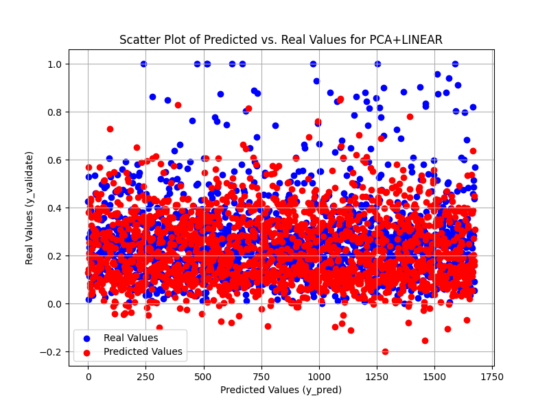

# Function Approximation Methods

## Description of the Process/System Details:

The Debutanizer column is a crucial component in the distillation process. It separates propane (C3) and butane (C4) from the naphtha stream. The main objectives are to increase the concentration of stabilized gasoline (C5) in the overheads and to decrease the concentration of butane (C4) in the bottoms. Soft sensors based on linear regression and higher order regression along with feature extraction methods like Principal Component Analysis (PCA) are implemented for improved control quality.

### Dimensionality of the Problem:

**Input or predictor variables (u):**
- u1: Top Temperature
- u2: Top Pressure
- u3: Reflux Flow
- u4: Flow to Next Process
- u5: 6th Tray Temperature
- u6: Bottom Temperature (repeated)
- u7: Bottom Temperature (repeated)

**Target variable or response variable (y):**
- Percentage of C5 in C4 (F_C5)

## Aim/Objective for the Assigned System:

The objective is to develop soft sensors using linear regression and higher-order regression techniques to estimate the Percentage of C5 in C4 (F_C5) in the Debutanizer column. This aims to:
- Provide real-time estimation of F_C5 for proactive adjustments to process parameters.
- Reduce operational costs by minimizing reliance on expensive laboratory analyses.
- Enhance process control and stability for consistent product quality and reduced waste.

## Feature Extraction Methods along with Regression Models:

### Lasso Regulation with Linear Regression:
- MSE LOSS: 0.03241180293154075
- AIC: 16.858465269020208
- BIC: 39.74081311426133

### Lasso Regulation with 2nd Order Regression:
- MSE LOSS: 0.02481301269715393
- AIC: 19.392774115781226
- BIC: 46.851591530070564

### Lasso Regulation with 3rd Order Regression:
- MSE LOSS: 0.02244005206459875
- AIC: 13.42306402875656
- BIC: 27.15247273590123

### PCA with Linear Regression:
- MSE LOSS: 0.044719823733125205
- AIC: 10.214676783420057
- BIC: 21.061813671938392

### PCA with 2nd Order Regression:
- MSE LOSS: 0.023987154250022288
- AIC: 11.460473663016867
- BIC: 22.307610551535202

### PCA with 3rd Order Regression:
- MSE LOSS: 0.024285145721552204
- AIC: 11.435780805453478
- BIC: 22.28291769397181

### K-Fold with Linear Regression:
- MSE LOSS: 0.057633911176724555
- AIC: 19.809656966120116
- BIC: 51.84494394945769

### K-Fold with 2nd Order Regression:
- MSE LOSS: 0.030892300847618723
- AIC: 21.070816439005092
- BIC: 53.10610342234266

### K-Fold with 3rd Order Regression:
- MSE LOSS: 0.029712149840376605
- AIC: 20.918184972209723
- BIC: 52.95347195554729

## Error Minimization Along Regression Models:

### Linear Model Residual Plot:

### Polynomial 2nd Order Model Residual Plot:

## Additional Visualizations:

### PCA Scatter Plot:

